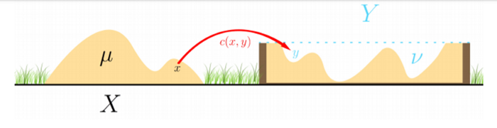

* toc
{:toc}

## 0. Paper info.
-------------------------------------------------------------------
- **A Brief Introduction to Optimal Transport Theory**  
  - [Bourne, D. P. "A Brief Introduction to Optimal Transport Theory." July 27th (2018).](http://www.maths.gla.ac.uk/~gbellamy/LMS/BourneLectures.pdf)  

Optimal Transport 이론을 석사 수준 이하로 쉽게 설명하는 논문으로, 내가 처음 공부하는 분야여서 연구실 선배들이 추천해주었다.  

## 1. Optimal Transport  
-------------------------------------------------------------------
Optimal Transport는 1781년 Gaspard Monge가 어떠한 집합체(mass)를 재구축하는 최적의 방법을 찾는 문제에 대한 관심을 가지며 시작되었다. 예를들어 거대한 흙 퇴적물을 이용하여 둑을 만든다고 하자. 이때, 가장 효율적으로 옮기는 **방법**을 찾는 것이 우리의 목적이다. 이를 통계로 가져와보자.

   

<figcaption style='color: #808080'>출처 : https://medium.com/analytics-vidhya/introduction-to-optimal-transport-fd1816d51086</figcaption>

  

   

위 그림처럼 원래 흙 퇴적물의 모양을 $$X$$의 분포라고 하고, 둑의 모양을 $$Y$$의 분포라고 하면 우리는 분포에서 분포로 변형해주는 함수를 얻고자 한다. 이를 **Transport**라고 하는데, 이는 여러가지가 있을 수 있다. 여러 **Transport** 중 가장 효과적인(즉, 비용이 적게 드는) **Transport**를 **Optimal Tranport**라고 하고 이를 찾고자 한다.

## 2. Monge Problem
-------------------------------------------------------------------
위에서 설명한 문제를 수학적으로 정리하고자 한다.

**Notation**  

- **Push-forward**  
  Let $$X, Y \subseteq \mathbb{R}^{d}$$ and $$T: X \rightarrow Y$$. Let $$f$$ be a probability density on $$X$$ and $$g$$ be a probability density on $$Y$$. We say that $$g$$ is the push-forward of $$f$$ under $$T$$, and write $$g=T \# f$$, if  
        $$\int_{B} g(y) \mathrm{d} y=\int_{T^{-1}(B)} f(x) \mathrm{d} x \quad \forall B \subseteq Y .$$  
  In other words, the mass of the set $$B$$ with respect to the density $$g$$ equals the mass of the set $$T^{-1}(B)$$ with respect to the density $$f$$.  

- **Convex and concave functions**  
  Let $$I \subseteq \mathbb{R}$$ be an interval (possibly unbounded). We say that $$h: I \rightarrow \mathbb{R}$$ is convex if for all $$\lambda \in(0,1), x, y \in I, x \neq y$$,  
        $$  h((1-\lambda) x+\lambda y) \leq(1-\lambda) h(x)+\lambda h(y) .$$  
  We say that $$h$$ is strictly convex if the inequality in (2.2) is strict. We say that $$h$$ is concave if $$-h$$ is convex and strictly concave if $$-h$$ is strictly convex.  

**The Monge problem**  

---  
> **[Definition 1]**  
> Let $$X, Y \subseteq \mathbb{R}^{d}$$. Let $$f$$ be a probability density on $$X$$ and $$g$$ be a probability density on $$Y$$. Let $$c: X \times Y \rightarrow[0, \infty)$$ be continuous. The Monge problem is to find a transport map $$T: X \rightarrow Y$$ satisfying $$T \# f=g$$ such that $$T$$ minimises the cost functional  
>       $$ M(T):=\int_{X} c(x, T(x)) f(x) \mathrm{d} x .$$  
> The optimal transport cost $$\mathcal{T}_{c}(f, g)$$ of transporting $$f$$ to $$g$$ with cost function $$c$$ is defined by  
>       $$\mathcal{T}_{c}(f, g):=\inf_{T \# f=g} M(T) = \min_{T \# f=g} M(T)$$  
---  

이 논문에서는 $$inf$$ 과 $$min$$을 같은 의미로 사용한다.  
**Monge Problem**에서 근본적인 질문은 다음과 같다.  
  - 최적의 Transport map $$T$$가 존재하는가?  
  - 존재한다면 이는 unique한가?  
  - 문제에 맞는 $$T$$에 대한 구체적인(수식으로 표현할 수 있는) 식을 찾을 수 있는가?  
  - 구체적인 식을 찾을 수 없다면 $$T$$에 대한 성질에 대하여 설명할 수 있는가?  
위 질문들에 대한 답은 cost인 $$c$$와 확률밀도함수 $$f$$, $$g$$에 따라 결정된다.  

---  
> **[Example 1]**  
> 위 [Definition 1]을 퇴적물과 둑 예시로 간단하게 설명한다면 다음과 같다.  
> 퇴적물의 공간 : $$X$$, 둑의 공간 : $$Y$$, $$X = Y = \mathbb{R}^{3}$$  
> 퇴적물을 옮기는데 사용되는 비용 : $$c(x, y) = |x-y|$$  
> 기존 퇴적물의 밀도 : $$f$$, 둑의 밀도 : $$g$$  
---  

특이한 점으로 **Monge Problem**에서 $$X$$와 $$Y$$의 총 밀도가 1일 필요는 없다. 하지만 $$X$$와 $$Y$$의 총 밀도의 값이 같아야 한다. 즉, $$\int_{X} f(x) \mathrm{d} x=\int_{Y} g(y) \mathrm{d} y$$ 이 만족해야 한다.  
만약 $$\int_{X} f(x) \mathrm{d} x \neq \int_{Y} g(y) \mathrm{d} y$$ 이라면 $$T \# f=g$$를 만족하는 $$T$$가 존재하지 않고, $$\mathcal{T}_{c}(f, g)=+\infty$$ 이다.