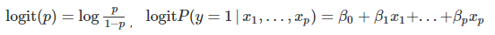

* toc
{:toc}

  

# Machine Learning  

## 1. 정의
> **기계 학습(Machine Learning)** 은 경험(Data)을 통해 자동으로 특정 작업에 대한 성능을 향상시키는 컴퓨터 알고리즘의 연구이다.

데이터가 많아지고 컴퓨터의 성능이 좋아짐에 따라 기계 학습에 대한 관심은 아직도 증가하고 있다. 특히 기계 학습에서도 통계학에서 많이 사용하는 분야로 Deep Learning이 있는데, 이는 인공 신경망(artifitial neural networks)를 이용하여 특징 학습(feature learning)을 하는 것 이다.

## 2. 구분  
<left></left>  

머신러닝은 일반적으로 다음과 같이 세 가지 넓은 카테고리로 분류된다.
  * Supervised Learning (지도 학습)
  * Unsupervised Learning (비지도 학습) 
  * Reinforcement Learning (강화 학습) 

  **1) Supervised Learning (지도 학습)**  
    ▶ 지도 학습이란 알고싶은 target이 명확한 데이터를 활용해 학습을 하는 것이다.  
    ▶ 지도 학습은 대표적으로 분류와 회귀로 나뉜다. 분류에는 범주형 변수가 들어가며 로지스틱 회귀나 Tree 등과 같은 알고리즘이 있다. 회귀에는 연속형 변수가 들어가며 일반적인 선형 회귀분석이 여기에 해당한다.

  **2) Unsupervised Learning (비지도 학습)**  
    ▶ 비지도 학습이란 지도 학습과는 다르게  target에 대한 정보가 없는 데이터를 활용해 학습을 하는 것이다.  
    ▶ 대표적인 예로 클러스터링(Clustering)과 차원 축소(Dimentionality Reduction) 등이 있다.  

  **3) Reinforcement Learning (강화 학습)**  
    ▶ 머신러닝의 꽃이라 불리는 강화 학습은 행동 심리학에서 나온 이론으로, 자신이 한 행동에 대한 보상(reward)를 받으며 학습을 하는 것이다.  
    ▶ 강화 학습은 입출력 쌍으로 이루어진 훈련 집합이 제시되지 않으며, 잘못된 행동에 대해서도 명시적으로 정정이 일어나지 않는다는 점에서 일반적인 지도 학습과는 다르다.  
    ▶ 강화 학습은 장기, 단기의 포상 사이 트레이드오프가 존재하는 문제를 다루는 데 적합하다.

## 3. 종류  
기계학습에는 많은 종류의 모델이 있다. 현실적으로 모든 모델을 공부하는 것은 불가능하므로 대표적인 몇 가지 예시들에 대하여 간단하게 정리를 하려고 한다.  
예시는 다음과 같다.  
- 단일 모델: Decision Tree / Regression
- 앙상블:
  - RandomForest
  - GBM
  - LightGBM
  - XGBoost

 

# Simple Model  

## 1. Decision Tree
의사결정나무(Decision Tree)는 스무고개를 하듯 예/아니오 질문을 이어가며 학습을 진행하는 지도학습 모델 중  
하나이다. 의사결정나무는 데이터 마이닝에서 일반적으로 사용되는 방법이며, 분류와 회귀 모두 사용 가능하다.  
하지만 대부분의 경우에 분류 문제에서 사용을 한다. 아래 그림은 의사결정나무를 도식화 한 그림이다.  

  

위 그림에서 질문이나 정답이 담겨있는 상자를 노드(Node)라고 한다. 
맨 처음 질문 상자를 루트 노드(Root Node),  
중간 질문 상자를 Intermediate Node, 마지막 정답을 담고있는 상자를 터미널 노드(Terminal Node)라고 한다.  
   
의사결정나무의 진행 과정은 다음과 같다. 우선 아래 그림과 같이 분류하고자 하는 대상을 가장 잘 분류하는 조건을  
찾아 첫 번째 가지를 친다.  

<left></left>  

그 다음, 각각의 분류된 영역에서 또 다시 잘 분류하는 조건을 찾아 두 번째 가지를 친다.  

<left></left>  

이러한 과정을 사용자가 지정한 횟수만큼이나 더 이상 나눌 수 없을 때까지 반복 시행한다. 이때 반복 횟수를  
'깊이'라고 하며 이 값이 너무 크면 아래 그림과 같이 기존 데이터에 과하게 적합(Overfiting)을 하는 경우가  
발생한다. 따라서 사용자가 이 값을 잘 조절하는 것이 향후 분석 결과에 영향을 준다.  

<left></left>  

   

## 2. Regression
회귀분석(Regression)이란 변수들 간의 함수적 관계를 밝히려는 통계적 분석 방법으로 영국의 유전학자이자  
우생학의 창시자인 갈튼이 1885년에 발표한 논문에서 유래된 지도학습 방법이다.  
이러한 회귀분석은 여러 통계적인 분석기법 가은데 가장 널리 쓰이는 기법이다.  
### 2-1. Linear Regression  
회귀분석에 사용되는 변수는 예측변수와 종속변수로 나뉜다.  
  - 종속변수(dependent variable) 혹은 반응변수(response variable)
    - 다른 변수에 의해 설명되는 변수
    - 보통 측정 오차를 수반함
  - 독립변수(independent variable) 혹은 설명변수(explanatory variable)
    - 다른 변수에 영향을 주거나 그 변수를 설명하는 변수
    - 보통 측정 오차가 없다고 가정

반응변수 $Y$와 하나의 설명변수 $X$간에 선형함수관계를 가정하여 모형을 적합 한 경우 이를 단순 회귀모형이라고 한다.
설명변수가 한 개 이상인 경우 다중회귀 모형이라고 한다.   

<left></left>  

다중회귀모형에서 $$Y$$와 각 $$X$$들은 데이터를 통하여 이미 알고 있는 값이고 계산을 통하여 $$b_0 , b_1 , … , b_n$$ 를 구해 새로운 데이터 $$X^*$$가 왔을 때 $$Y^*$$를 예측하는 것이다.  $$b_0 , b_1 , … , b_n$$ 를 구하는 방법으로 최소제곱오차 방식을 사용하는데, 이는 예측 오차의 제곱합을 최소로 하는 $$b_0^* , b_1^* , … , b_n^*$$ 를  $$b_0 , b_1 , … , b_n$$ 로 사용한다는 것이다.  

  

위 그림을 보았을 때, 실제 값인 점들 사이를 지나는 직선이 회귀선이며, 새로운 $$X^*$$가 주어졌을 때, 직선에서 $$X^*$$에 해당하는 위치에 $$Y^*$$를 예측값으로 사용한다.  

### 2-2. Logistic Regression  
로지스틱 회귀모형(Logistic regression)은 반응변수가 성공(1), 실패(0) 두 가지 값을 갖는 이항 변수인 경우에 대한 회귀모형으로 일반화선형모형의 대표적 방법론이다.  
반응변수가 연속형인 경우와 달리, 이항 변수인 경우 X가 주어졌을 때 성공이 나올 확률로 취할 수 있는 값의 범위가 0과 1 사이의 값으로 제한된다. 이를 무시하고 통상적인 회귀분석을 적용하면 예측값이 허용 범위인 0과 1 사이를 벗어나는 경우가 발생해 문제가 된다. 따라서 다음과 같이 link function을 이용해 변환한 모형으로 고려한다.  

<left></left>  

  