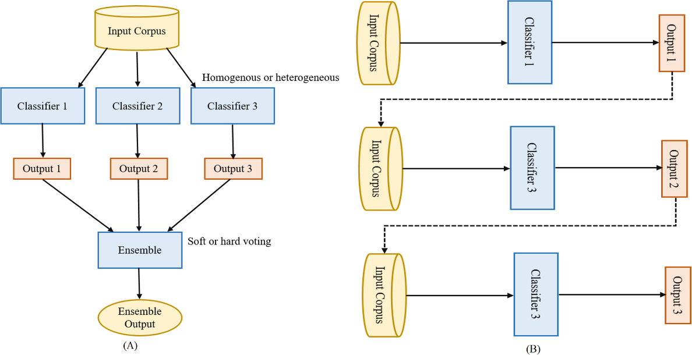
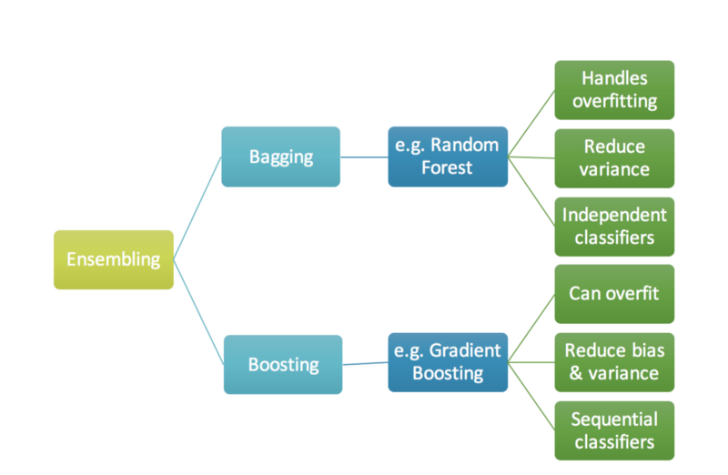
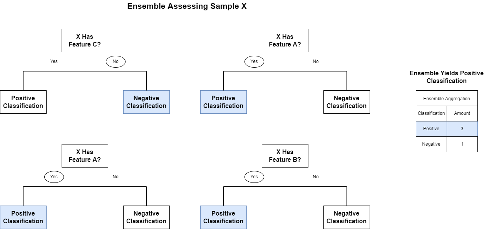

* toc
{:toc}

  

# Ensemble  

## 1. 정의  
> 앙상블 학습법이란 통계, 그리고 기계학습에서 단일 구성 학습 알고리즘보다 더 정확한 예측이 가능하도록 다수의 학습 알고리즘을 이용하는 방법이다.  

즉, 두 개 이상의 모델을 사용하는 방법을 통틀어 앙상블 방법이라고 한다. 실제 우리가 사용하는 대부분의 학습법은 이 앙상블 학습법에서 시작된다고 볼 수 있다.  
  
## 2. 특징  
앙상블 학습법은 단순한 알고리즘들에 많은 계산을 추가하여 Accuracy를 보안한다. Accuracy를 올리는 방법으로 앙상블 학습법 이외에도 단일 모델을 반복적으로 수행하는 방법이 있다. 하지만 데이터가 많거나 반복 횟수가 많다면 리소스 사용량 측면에서 앙상블 방법이 일반적으로 더 효율적이다. 또한 성능을 분산시키기 때문에 과적합(Ovefiting)에 대한 감소 효과도 있다. 보통 의사결정나무(Decision Tree)가 단순하고 효율이 좋아 앙상블에 자주 쓰인다.  

  

위 그림은 앙상블의 예시 그림이다. 분석에 쓰이는 모델들을 Classifier라고 하며, 단일 모델이나 앙상블 모델이 들어갈 수 있다. 

## 3. 종류  
앙상블 학습법은 Classifier들이 병렬적으로 나열되어 한번에 계산되고 결과들을 취합(Aggregating) 하는 배깅(Bagging) 방법과, 직렬적으로 나열되어 순차적으로 결과를 계산하고 잘못 계산한 것에 대하여 가중치를 업데이트하는 방법(Boosting)으로 진행된다. 병렬적으로 진행하는 대표적인 앙상블 학습법으로는 랜덤포레스트(RandomForest)가 있으며, 직렬적으로 진해하는 앙상블 학습법으로는 GBM(Gradient Boosting Method)이 있다.

  

취합(Aggregating)의 방식으로 다수결 투표(Voting) 방식을 자주 사용하는데 이는 각각의 모델들이 출력한 Output을 기준으로 가장 많이 나온 값(최빈값)을 최종 결과로 사용한다는 것이다. 최빈값을 사용하는 것 이외에도 평균값을 사용하는 등 여러 취합 방식들이 있다. 다음 그림은 Voting에 대한 예시 그림인데, 네 가지 모델 중 세 가지에서 Yes로 예측을 하였으므로 Yes를 최종 선택한다는 내용이다.

  