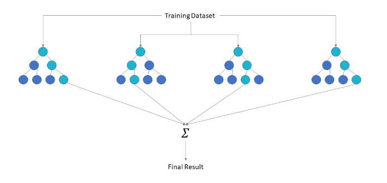
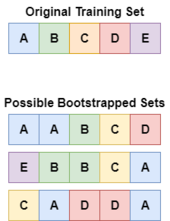
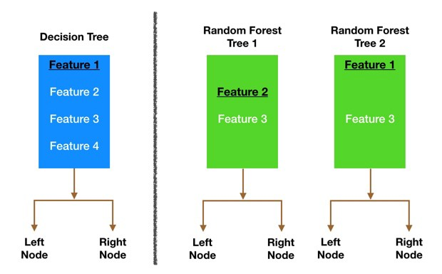

* toc
{:toc}

  

# Random Forest  

## 1. 정의  
> 랜덤포레스트 알고리즘은 여러 개의 단순 Tree들을 조합하여 하나의 결과를 도출하는  가장 흔히 알려진 머신러닝 알고리즘 중 하나이다.  

## 2. 작동원리  
랜덤포레스트 알고리즘은 bagging을 이용한 앙상블 기법 중 하나이다. 여러 Tree들을 앙상블할 때, 모두 같은 구조를 가지는 Tree들이면 앙상블에 의미가 없어진다. 이를 위하여 RandomFroest에서는 Bootstrap sampling과 Feature randomness을 이용하여 나무를 만든다.  
### 1) Bootstrap sampling  

  

    
  
  
    Bootstrap sampling이란 n개의 원래의 훈련 데이터셋에서 중복을 허용하며 랜덤으로  
    n개를 추출하는 것을 뜻한다. 또한 out-of-bag 셋이라는 side-product를 생성한다.  
    Out-of-bag 데이터셋은 원래의 훈련 데이터에서 부트스트랩 셋으로 선택되지 못한  
    나머지 전부로 구성된 셋이다. 부트스트랩 데이터셋은 각각 한 개의 out-of-bag  
    셋(빈 집합일 수도 있음)을 가지고 있다. 오른쪽 그림은 5개의 데이터를 가지고 있는  
    기존 훈련 데이터셋에서 3개의 부트스트랩 셋을 뽑는 예시 그림이다.  

 

### 2) Feature randomness  
Feature randomness이란 원래의 데이터셋에서 사용되는 설명변수의 부분집합을 활용하는 것이다. 아래 그림은 일반 Tree 모형과 RandomForest의 변수 선택을 나타내는 예시 그림이다.  

  

### 3) Voting  
랜덤포레스트는 Aggregating으로 앞 포스트에서 설명한 Voting 방식을 이용한다. 아래 그림은 랜덤포레스트에서 Voting 방식으로 Aggregating을 하는 예시 그림이다.  

  

## 3. 장ㆍ단점  
> **장점**  
  - 예측의 변동성이 줄어든다.  
    기존 훈련 데이터셋에서 랜덤으로 추출하므로 한쪽으로 기울어진 결과가 나오지 않는다.  
  - 과적합을 방지한다.  
    부트스트랩셋을 만들 때, 일부 데이터는 뽑히지 않는 경우가 발생하여 과적합을 방지한다.  
  - 결측치의 비율이 높아져도 높은 정확도를 나타낸다.  
  - 변수의 중요성을 파악할 수 있다.  
    나무 모형에서 나누어지는 기준을 보고 변수의 중요성을 파악할 수 있다.

> **단점**  
  - 메모리 사용량이 굉장히 많다.  
    Decision Tree를 만드는 것 자체가 메모리를 많이 사용하는데, 여러 개를 종합 해야하니 메모리 사용량이 크다.  
  - 예측과 크게 상관없는 변수가 늘어나면 성능이 떨어진다.  
    모형 내에서 따로 변수선택의 과정을 거치지 않기 때문에 예측과 크게 상관없는 
    변수가 들어온다면 정확도가 떨어진다. 하나의 나무를 만들 때 사용되는 변수 수를 
    늘려 이 문제를 해결할 수 있지만, 그러면 계산 속도가 느려진다.  
